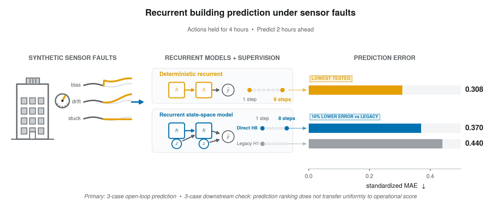

# Multi-Step Supervision in Recurrent Building World Models under Sensor Faults and Action-Dwell Shift



Code, data, and results for a study of short-horizon building prediction under
sensor faults. We compare recurrent models that predict zone temperature and
HVAC electric power two hours ahead - eight steps of fifteen minutes - while
sensors are degraded, and we repeat the comparison under two action-dwell
schedules that hold each supervisory action for two or four hours. All results
come from three public
[BOPTEST](https://github.com/ibpsa/project1-boptest) simulator cases. A second,
smaller evaluation asks whether prediction accuracy carries over to supervisory
setpoint selection.

## Results

Both effects are paired differences over five seeds, with 95% intervals.

The prediction horizon is two hours throughout; the rows differ in how long a
supervisory action is held. The `policy` column gives the identifier used in
`results/neural/primary_estimands.csv`, so each row can be traced to its source.

The labels match Table 1 of the paper. The last column gives the `policy` value
in `results/neural/primary_estimands.csv`, so each row traces to its source.

| Policy | Contrast | Effect | Estimate | 95% interval | `policy` |
| --- | --- | --- | --- | --- | --- |
| 4 h (primary) | D | Direct-H8 supervision, vs. legacy stochastic model | +15.96% | [+5.22%, +25.11%] | `new_4h` |
| 4 h (primary) | A | Architecture, stochastic vs. deterministic model | -20.21% | [-48.31%, -3.50%] | `new_4h` |
| 2 h (control) | D | Direct-H8 supervision, vs. legacy stochastic model | +16.66% | [+6.33%, +25.02%] | `old_2h` |
| 2 h (control) | A | Architecture, stochastic vs. deterministic model | -21.82% | [-50.12%, -2.45%] | `old_2h` |

The four-hour dwell is the primary condition. The two-hour dwell is the schedule
the models were developed under, carried through as a control to test whether
the effects transport across dwell. Intervals are the `ci95_*` columns; the file
also records 90% intervals, which are not quoted here.

Two findings, pointing in different directions. Adding direct eight-step
supervision to the stochastic recurrent state-space model lowers its error
substantially, and the effect is positive in all three cases, all three
silent-fault families, and all five seeds. That same model still loses to a matched deterministic
recurrent model on this benchmark. The downstream evaluation did not reproduce
the supervision advantage: in the two response-unseen cases, direct-H8 was not
better than legacy in any of the 12 condition cells, while the deterministic
model was better than direct-H8 in all 12.

Source of record: [`results/neural/primary_estimands.csv`](results/neural/primary_estimands.csv).

### Sign conventions

Each effect is one minus a ratio of mean absolute errors, so positive favours
the first-named arm.

| Effect | Definition | Positive means |
| --- | --- | --- |
| Architecture | 1 - MAE(stochastic) / MAE(deterministic) | stochastic model is better |
| Direct-H8 | 1 - MAE(direct-H8) / MAE(legacy) | direct-H8 objective is better |
| Ridge-ARX | 1 - MAE(deterministic) / MAE(Ridge-ARX) | recurrent model is better |
| RC | 1 - MAE(neural) / MAE(RC) | neural model is better |

The downstream operational score combines cost and discomfort with equal weight
on fixed operational budgets; its neutral reference is zero and lower is better.

## Repository layout

```
building_fault_wm/
  recurrent_models/        stochastic recurrent state-space model
  neural_benchmark/        fault generation, training, study configuration
    data/                  72-trajectory locked-test corpus (80 files)
  deterministic_transport/ deterministic recurrent model and its evaluation
  transport_collection/    trajectory collection
  transport_evaluation/    evaluation contracts
  ridge_arx/               Ridge-ARX comparator
  ridge_arx_sensitivity/   strengthened Ridge-ARX sensitivity study
  subspace_baseline/       subspace identification comparator
  rc_baseline/             2R2C resistance--capacitance comparator
  comparison_guard/        matched-comparison identity checks
  downstream_control/      supervisory selection policies
  downstream_multicase/    three-case downstream evaluation
results/                   result tables in CSV and JSON
scripts/                   verification entry points
```

One implementation of each study component is included. Model checkpoints,
step-level downstream trajectories, and the larger evidence packages are in the
archive deposit rather than here.

## Getting started

Python 3.10 or newer; 3.10 is the version the reported results were produced
with.

```bash
git clone https://github.com/Cgisu/direct-h8-building-world-models.git
cd direct-h8-building-world-models

python3 -m venv .venv
.venv/bin/pip install -r requirements.txt

PYTHON=.venv/bin/python bash scripts/verify_all.sh
PYTHONDONTWRITEBYTECODE=1 .venv/bin/python -m pytest -q
```

A conda alternative is provided in `environment.yml`.

`scripts/verify_all.sh` checks that the files match `FILE_MANIFEST.sha256`, that
the downstream result receipts are self-consistent, and that the model and
evaluation contracts hold. It runs offline and needs no simulator or GPU.

Pointing pytest at the study modules, `python -m pytest building_fault_wm -q`,
reports 283 passed and 40 skipped. The skipped tests check provenance against
the separately deposited evidence packages and the original module layout, so
they cannot run here; `scripts/non_portable_tests.txt` lists them.

## Data

`building_fault_wm/neural_benchmark/data/` holds the 72-trajectory locked-test
corpus, together with its manifest, disjointness certificate, and per-trajectory
receipts. These are the response-unseen windows the models are evaluated on. No
model is fitted on any trajectory in this directory; the development
trajectories are in the archive deposit.

The corpus shipped here is a compact re-encoding of the collected originals, so
its bytes do not reproduce the per-file `sha256` values recorded in
`data/manifests/locked_transport_corpus_manifest.json`. That manifest describes
the archived originals, which are in `Primary_Evidence.zip` under
`legacy_v5_package/corpus/locked_transport_raw/` in the deposit and verify
72/72 against it. Integrity of the files in this repository is covered instead
by `FILE_MANIFEST.sha256`, which `scripts/verify_repository.py` checks. The
corpus manifest remains authoritative for provenance: it pins the BOPTEST
commit and the collection worker image that produced the trajectories.

`results/` holds the tables the paper's figures and tables are generated from.

| Path | Contents |
| --- | --- |
| `results/neural/` | Primary estimands, per-horizon arm MAE, stratum and fault-family effects, H8 boundary diagnostics, model resource counts |
| `results/ridge_arx/` | Ridge-ARX selection grid, selected hyperparameters, per-horizon description, sensitivity result |
| `results/subspace/` | Subspace comparator result and selected hyperparameters |
| `results/rc/` | RC comparator result, selected hyperparameters, and the three selected 2R2C models |
| `results/downstream/` | Protocol, tuning record, 1,296 episode summaries (3 cases x 6 policies x 72 episodes), aggregate and paired-effect tables |

The larger evidence deposit is at <https://doi.org/10.5281/zenodo.22194729>. The full
comparator evaluation expects the neural evidence package at
`external_evidence/neural_evaluation_package/`; the verification above does not
need it.

## Scope

The primary study measures open-loop prediction error, not closed-loop control
performance. All results come from three deterministic simulator cases with
synthetic sensor faults, so they do not speak to occupied-building performance
or to deployment safety. The downstream evaluation is descriptive and covers a
finite set of cases; it is not a population-level controller ranking. The
intervals describe seed-level variation under one prespecified training budget
and compare two matched pipelines, rather than model classes in general.

## Citation

The manuscript is prepared for submission and not yet published, so no venue or
article DOI is given here. Machine-readable metadata is in
[`CITATION.cff`](CITATION.cff).

```bibtex
@unpublished{ghebrehiwet_directh8,
  title  = {Multi-Step Supervision in Recurrent Building World Models under
            Sensor Faults and Action-Dwell Shift},
  author = {Ghebrehiwet, Isaias and Zaki, Nazar},
  note   = {Manuscript prepared for submission}
}

@dataset{ghebrehiwet_directh8_data,
  title     = {Direct-H8 Building World Models: Frozen Data and
               Reproducibility Evidence},
  author    = {Ghebrehiwet, Isaias and Zaki, Nazar},
  publisher = {Zenodo},
  doi       = {10.5281/zenodo.22194729}
}
```

## License

Code is BSD 3-Clause ([`LICENSE`](LICENSE)). The trajectory tables, derived
metadata, and result tables are CC BY 4.0
([`licenses/LICENSE_DATA.txt`](licenses/LICENSE_DATA.txt)). Upstream material
keeps its original terms
([`licenses/THIRD_PARTY_NOTICES.txt`](licenses/THIRD_PARTY_NOTICES.txt)).

The simulator is IBPSA Project 1 BOPTEST at commit
`0f8a467cb1823f005b6512937e9333c65e1e483e`; receipts are in
[`external/`](external/).

## Contact

Isaias Ghebrehiwet — ighebrehiwet@uaeu.ac.ae
Nazar Zaki (corresponding author) — nzaki@uaeu.ac.ae

The Center for AI and Digital Innovation, United Arab Emirates University,
Al Ain, United Arab Emirates.

Questions and reproduction problems are welcome as repository issues; see
[`CONTRIBUTING.md`](CONTRIBUTING.md).
